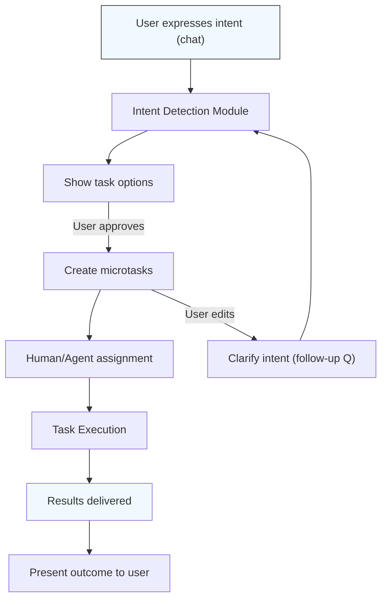

# Archive — Converting Unfulfilled User Intents to Microtasks: A Market and Design Analysis
 
> Editor note
>
> This document is retained as precursor research, not as Boreal's current source of truth.
>
> The root thesis still matters: expressed demand often disappears into logs, chats, abandoned flows, and unresolved product friction before it becomes fulfilled work.
>
> That thesis directly informed Boreal's broader direction, but the product has since expanded beyond a pure microtask marketplace framing.  Boreal now centers on request-native commerce, routed supply, proposals, tracked fulfillment, provider-backed services, and Solana-aligned settlement architecture.
>
> For current product direction, use these documents first:
>
> - `../WHITEPAPER.md`
> - `../ROADMAP.md`
> - `../MATCHING_ENGINE.md`
> - `../COMMERCE_STANDARDS.md`
> - `../SERVICE_PROVIDER.MD`

**Executive Summary:** Modern AI and analytics capture vast user behavior data, yet many user **intents** remain unfulfilled, hidden in logs and session data. This report analyzes the need for a *new platform* that detects these latent intents (from logs, heatmaps, chat transcripts, etc.) and converts them into actionable microtasks for humans or AI agents. We examine market demand, task types, decomposition methods, human-vs-agent routing, pricing strategies, UI/UX design for an intent-to-task chat interface, data pipelines, quality controls, legal/privacy issues, system architecture, and go-to-market plans. Key insights include: (1) Many tasks (e.g. image labeling, content moderation, data lookup) are inherently human-intensive【24†L53-L60】; (2) Effective task allocation requires careful pricing and assignment mechanisms【24†L69-L77】【58†L70-L78】; (3) Proven “human-in-loop” workflows use confidence thresholds to route uncertain tasks to people【12†L46-L54】【18†L190-L199】; (4) Privacy and consent are critical since user data (even chat inputs) are often used by default for AI training【45†L126-L134】. We propose a hybrid system that bridges analytics with crowdsourcing, outline pilot metrics (e.g. completion vs escalation rates, time per task【14†L179-L187】), and suggest a 6–12 week pilot plan with milestones. Tables compare pricing models and task-matching methods, and mermaid diagrams illustrate the system architecture and user flows. 

## Market Need and Gap Analysis  
Current analytics and support systems often surface friction (e.g. high cart abandonment, unanswered searches) but stop short of action.  For example, *journey analytics* tools can reveal that users are abandoning forms or chats【33†L394-L402】, yet translating these insights into tasks requires manual triage. Meanwhile, **crowdsourcing demand is huge**: tasks like image labeling, sentiment analysis, content moderation, and transcription are commonly needed because they are hard or expensive to automate【24†L53-L60】. Millions of microtasks are performed daily, but platforms give requesters limited support for pricing and allocating them【24†L69-L77】. This gap suggests a market opportunity: enterprises increasingly adopt AI but still rely on human work for complex tasks. A platform that automatically converts analytics signals (e.g. failed queries, partial form fills, chatbot logs) into tasks could improve conversion rates and user satisfaction.  

*Evidence & Sources:* Singer et al. note that many ML pipelines depend on “crowdsourcing tasks” (image labeling, content moderation, etc.) because they cannot be fully automated【24†L53-L60】. They also highlight that designing pricing and allocation is “challenging” for requesters【24†L69-L77】, implying a demand for better tools. On the user-side, companies have found that capturing full interaction data (versus partial event tagging) reveals hidden opportunities【33†L386-L389】. This underscores the need to act on unfulfilled intents identified in analytics. 

## Types and Sources of Unfulfilled Intents  
Unfulfilled user intents can be **detected in various data sources**: 

- **Search and query logs:** Repeated or modified queries with no successful result indicate a struggling information need. Studies show users issue multiple similar queries and “quick-back” clicks when search fails to find answers【35†L199-L205】. 
- **Clickstream and analytics data:** Session replays, heatmaps, and funnel analysis can reveal where users expect actions that never complete. For example, a company noted users dropping off during form-filling and chat support without understanding why【33†L394-L402】. 
- **Chatbot and helpdesk transcripts:** Unresolved or repeated questions in support logs indicate unmet intent. Users may type things that agents or bots can’t handle (e.g. niche queries or complex requests). 
- **Product and UI usage:** Hotspots in UI heatmaps (e.g. clicks on non-responsive elements) or “dead ends” (attempts to perform unavailable actions) signal user needs. 
- **Transaction logs:** Partial checkouts, abandoned carts, or incomplete sign-ups often mark transactional intents that were abandoned. 

Taxonomies from related fields can guide us. In information retrieval, user queries are often classified as *navigational*, *informational*, or *transactional* (Broder et al.)【37†L159-L164】. Similarly, unfulfilled intents can be grouped: **informational needs** (e.g. unanswered search questions), **transactional needs** (unfinished purchases, failed bookings), and **service requests** (e.g. account setup, technical support that was not provided). Capturing these intents requires logging and analysis of user interactions: comprehensive clickstream tools that “capture every single interaction”【33†L386-L389】, search engine logs, chatbot transcripts, and backend event logs can all feed an intent-detection pipeline. Advanced methods (like building user-specific knowledge graphs of actions) have been proposed to store users’ intents and feedback for recommendation【6†L65-L73】.  

## Taxonomy of Intents Suitable for Microtasking  
Not all detected intents should become microtasks. We propose categorizing intents by **complexity and decomposability**. Suitable categories might include:

- **Data-centric tasks:** e.g. *information lookup* (find specific data from documents or websites), *verification/validation* (check facts, data entry, categorization). These are well-suited for human annotators. 
- **Routine or administrative tasks:** e.g. *scheduling/booking* (making appointments, reservations), *account management* (e.g. updating profile info), or *simple errands* (like travel booking research). Many of these can be structured as form-based microtasks.
- **Content-related tasks:** e.g. *writing/editing small content* (email drafts, short summaries), *translation*, *transcription*. Singer et al. list content generation and transcription among common microtasks【24†L53-L60】.
- **Moderation and compliance tasks:** e.g. *image or text review*, *policy compliance checks*, *sensitive content flagging*. Tasks like image moderation are explicitly noted as microtask staples【24†L53-L60】.
- **Customer support tasks:** e.g. answering specific user questions or following up on issues. If a user chat is unresolved, parts of it might be turned into discrete help tickets.

By contrast, deeply creative or highly strategic requests (e.g. full product redesign) are not microtaskable. A taxonomy combining IR intent types (informational/transactional) with task attributes (simple/form-fill vs. complex/creative) can help filter. For instance, *Transactional intents* like “book a flight” might be split into microtasks: search options, compare prices, finalize booking. *Informational intents* like “find annual revenue of company” can become a search and verification microtask. We will apply such categories when mapping logs to microtasks. 

## Task Decomposition Methods  
Once an intent is identified, it must be broken into microtasks that are small, independent, and automatable if possible. Two complementary approaches are common:

- **Wizard-of-Oz followed by iterative refinement:** Initially prototype as a single macro-task (possibly human-executed) and observe patterns of what subtasks repeatedly occur. In Calendar.help, for example, developers started with human schedulers and identified common subtasks (extracting meeting duration, attendees, dates) that were then turned into automated or microtask subtasks【12†L69-L77】【14†L99-L107】. The pipeline is progressively distilled: any step that can be automated or crowdsourced is split out. Washington et al. describe such pipelines as decomposing a scheduling workflow into formal microtasks based on recurring patterns【14†L99-L107】.
- **Programmatic breakdown (LLM/agent workflows):** Using LLMs or defined flows to split tasks. Anthropic’s guide recommends *prompt chaining* and *routing* patterns【48†L118-L127】【48†L139-L148】. In **prompt chaining**, an LLM handles a complex intent by generating intermediate outputs at each step (with optional checks). In **routing**, the system classifies the intent (e.g. “Is this question about refunds or tech support?”) and directs it to a specialized workflow. This aligns with our needs: for example, a user message “I want to return my order” could be routed to a returns microtask workflow, whereas “How do I reset password?” goes to an account support workflow.

  
```mermaid
flowchart LR
  subgraph User & Data
    U[User] -->|interaction, logs| Logs[Event Logs & Heatmaps]
    U -->|query/chat| Chat[Chat Interface]
    Logs --> Pipeline[Intent Detection Pipeline]
    Chat --> Pipeline
  end
  subgraph Task Generation
    Pipeline --> KG[Knowledge Graph / DB of Intents]
    KG --> TaskPlanner[Task Planner \n(decomposition & priority)]
    TaskPlanner --> TaskQueue[Microtask Queue]
  end
  subgraph Execution
    TaskQueue -->|assign| AgentPool[AI Agent(s)]
    TaskQueue -->|assign| HumanPool[Human Workers]
    AgentPool --> ResultDB[Results & Feedback]
    HumanPool --> ResultDB
  end
  subgraph Feedback
    ResultDB --> QualityCtrl[Quality Control & Verification]
    QualityCtrl --> KG
    QualityCtrl --> Pipeline
    QualityCtrl --> Moderation[Moderation & Auditing]
  end
  classDef system fill:#f2f2f2;
  class Pipeline,TaskPlanner,TaskQueue,QualityCtrl,Moderation system;
```

## Human vs. Agent Allocation Rules  
A central design is how to route each microtask to humans or AI agents. Best practices suggest a **confidence-based, tiered approach**【12†L46-L54】【14†L112-L120】: attempt automated resolution first, then escalate uncertain tasks to humans. For instance, Calendar.help used a classifier for parsing scheduling inputs: if confidence ≥0.5 the automation’s output was accepted, otherwise the task was queued for human review【14†L112-L120】. Similarly, OpenAI’s Agents SDK provides a *Human-in-the-loop* flow where certain tool calls are flagged as sensitive; the agent pauses and waits for a human to approve or reject before proceeding【18†L190-L199】. We would employ such logic: if an AI agent’s answer or action meets a confidence or safety threshold, it proceeds; if not, it is routed to a human microtask (or even escalated to an expert macrotask). 

Rules can also use **cost/efficiency tradeoffs**: trivial tasks (data lookup, basic classification) might be sent to AI, while tasks needing nuance (e.g. legal interpretation) go to humans. High-value users or tasks might always get human oversight. The platform could allow task requesters to mark specific types (e.g. “financial advice” or “medical info”) as requiring human approval. In sum, we’d implement a hybrid pipeline (tiered by automation confidence) and configurable policies, as illustrated in Table 2.

## Pricing and Budget Models  
We consider several pricing schemes for charging requesters and paying workers:

| Model           | Description                                                                                            | Pros                                                  | Cons                                                     |
|-----------------|--------------------------------------------------------------------------------------------------------|-------------------------------------------------------|----------------------------------------------------------|
| **Fixed-Price** | Pre-set rate per microtask (e.g. $0.05 each). Requesters budget based on task count.                   | Predictable cost; easy to implement.                  | May underpay or overpay if difficulty is misestimated.   |
| **Auction/Bidding** | Workers bid on tasks (or requesters post tasks and multiple candidates bid). Price set by market.       | Market-driven fairness; price discovery.              | Complex to implement; latency; may deter participants.   |
| **Subscription/Bundle** | Requester pays monthly fee or “task credits” bundle (e.g. 10k tasks/month).                     | Recurring revenue; encourages usage.                  | Risk of unused capacity; less flexible for small tasks.  |
| **Micropayments** | Very small payments per completed task (e.g. token-based or cents).                                  | Low barrier for trivial tasks; pay-per-use.           | Transaction overhead; may attract low-quality responses. |

Singer et al. note that designing pricing in crowdsourcing is challenging【24†L69-L77】. In experiments, they tested fixed threshold pricing (e.g. $0.04/task) vs randomized pricing【23†L939-L948】. An **auction/bidding model** (akin to Upwork) can allocate premium tasks efficiently but adds complexity. **Subscriptions or bulk credits** could target enterprise clients with steady demand. **Micropayments** (e.g. pay-per-query or token systems) might work for high-volume, very small tasks, but require efficient payment systems. We would likely start with a fixed-price or bundle model for simplicity, with future options for auctions or dynamic pricing based on supply/demand.

## UI/UX: Intent-to-Task Chat Interface  
We envision a *dedicated chat interface* where users express needs and manage tasks. Key elements include:

- **Dialogue-driven task creation:** The user’s intent (via chat or voice) is parsed and shown as suggested tasks (“It sounds like you want X done; shall I schedule a meeting? Provide a draft? Verify this information?”). Users can confirm, edit, or reject tasks before execution. This explicit confirmation (with simple “Approve/Cancel” buttons) ensures consent and correctness.
- **Affordances for delegation:** The UI must clearly indicate what a human or AI agent will do. For sensitive tasks (e.g. “Check my bank balance”), we show clear privacy notices and require opt-in. As one analysis notes, “clear affordances for delegation, permissioning, and auditability” are crucial【42†L48-L56】 (the user should know who/what is doing the work).
- **Task tracking and transparency:** Once tasks are dispatched, the chat should update with progress (“Sent to Human Agent,” “AI Agent working,” etc.) and final results. Users can ask for status or cancel a pending task. A dashboard or message thread will list all tasks generated from the conversation, giving the user full visibility.
- **Moderation and privacy:** Inputs and tasks are scanned for prohibited content (e.g. hate speech). The interface should let users redact or opt-out of data sharing. Given that major AI chat systems “by default feed user inputs back into models” for training【45†L126-L134】, our UI must explicitly ask permission or anonymize data. For example, an “Incognito” toggle could ensure the user’s data is not stored. The interface should also obfuscate any sensitive details before sending tasks to crowd workers (e.g. hashing personal identifiers) to protect privacy.

In essence, the UI blends the friendliness of a chat assistant with the controls of a task management system. It turns analytics triggers into conversational prompts, letting the user shepherd their intent through the task pipeline.  


*User flow:* The user speaks or types an intent, which is parsed by the system. The interface then suggests specific tasks to achieve that intent (e.g. “Book flights,” “Find X info”). The user can approve or refine tasks. Approved tasks are dispatched to humans or agents; results come back into the chat as fulfilled requests. This flow ensures consent and clarity at each step.

## Data Pipelines and Logging to Surface Intents  
Implementing this platform requires robust data capture:

- **Front-end and back-end logging:** Every user interaction should be logged in detail (clicks, scrolls, queries). Tools like FullStory that *“capture every single interaction automatically”* can build a complete behavioral picture【33†L386-L389】. These logs feed into an **analytics engine** that detects intent signals (e.g. repeated search terms, high dwell time on error pages).
- **Unified intent database:** We may use a knowledge graph or structured database (as in Pons et al. for analytics) to store events, recognized intents, and outcomes【6†L65-L73】. For example, the graph could link a user’s session, pages viewed, queries made, and any feedback (clicked tasks or not). This enables sophisticated queries like “find all users who looked for ‘refund policy’ but left the site.”
- **Real-time pipelines:** Streaming data platforms (e.g. Kafka) can push events into the intent engine. This allows real-time detection of unfulfilled intents (e.g. a user stuck on a page for 2 minutes). 
- **Triggers for microtasks:** Specific patterns in logs should trigger task generation. For instance, a log entry “Search: ‘dental insurance’ → no click” could create a task “Find top dental insurance providers and pricing.” A/B testing and feedback will refine which signals warrant tasks (to avoid overload).

In short, the data pipeline continuously siphons analytics and chat logs into an intent analysis module, which then queues microtasks when needed. Importantly, any logging that includes personal data must comply with privacy laws (see next section).

## Quality Control, Verification, and Reputation  
We will employ standard crowdsourcing QA practices to ensure reliable outputs:

- **Redundancy and consensus:** Each microtask can be sent to multiple workers/agents, and answers aggregated by majority vote or weighted scheme. If answers conflict, escalate to an expert or AI re-run. 
- **Gold-standard questions:** Embed control tasks with known answers to monitor workers. If a worker repeatedly fails gold questions, they are flagged or removed.
- **Automated assistance (pre-filled answers):** As part of the human-in-loop process, we can provide AI-suggested answers for workers to verify or correct. Washington et al. describe how *“presenting ML-generated suggestions as pre-filled answers”* accelerates task completion and provides built-in quality labels【14†L155-L158】.
- **Reputation and qualification:** Workers build a reputation score based on accuracy and speed. Tasks can be matched to higher-rated workers if accuracy is paramount. Over time, the system learns which workers excel at which task categories, improving assignment.
- **Final review:** Critical tasks may require supervisor review. For example, complex tasks can be double-checked by an expert. 

These measures, well-established in crowdsourcing platforms, ensure that the microtask outputs meet quality thresholds. As Singer et al. note, requesters often maintain tasks above a quality threshold via gold questions, majority voting, and cross-validation【24†L89-L98】. We will similarly design QC pipelines to verify microtask results before fulfilling the user’s intent.

## Legal, Ethical, and Privacy Considerations  
Handling user intents and microtasks raises significant concerns:

- **Privacy of user data:** Since the platform may capture sensitive user information, compliance with data protection laws (GDPR, CCPA) is mandatory. The Stanford report on AI chat privacy warns that many companies use user inputs to train models by default【45†L126-L134】. We must be transparent: users should explicitly consent to having their data used or not. Data should be anonymized before sending to workers. For example, personal identifiers in text should be redacted (e.g. replacing names with placeholders) to protect privacy.
- **Consent and transparency:** Users must understand what the platform will do with their intents and data. Each microtask created from the user’s input should be clearly explained and consented. We can log consent choices and allow users to revoke tasks. The UI needs a privacy policy in plain language, as AI privacy docs are often too opaque【45†L126-L134】.
- **Worker privacy and fairness:** Crowd workers should be paid fairly (at or above minimum wage equivalents). The platform must protect any user-sensitive data from being exposed. Tasks involving user identifiers (emails, addresses) should only be done by vetted workers under NDA, or handled by AI.
- **Ethical limits:** The platform should forbid tasks that involve malicious intent (e.g. hacking, impersonation, illegal activities). A moderation layer should block such requests.
- **Liability:** Clarify who is responsible if a task result causes harm. Likely the service provider must have disclaimers (e.g. “we do our best but cannot guarantee results”). For tasks like medical or legal advice, always route to qualified professionals.

By building strong privacy and ethical guardrails (opt-in models, auditing logs, encryption), we can minimize risks. The system’s design should follow privacy-by-design principles, given how critical this is in AI systems【45†L126-L134】.

## Technical Architecture and Integration  

Below is a high-level system architecture:

```mermaid
flowchart LR
  subgraph Data Layer
    LogsSys[Analytics & Logs] --> ETL[Data Pipeline]
    ETL --> IntentEngine[Intent Analysis Module]
    ChatSys[Chatbot Platform] --> IntentEngine
  end
  subgraph Backend
    IntentEngine --> TaskManager[Task Generation & Orchestration]
    TaskManager --> MicrotaskDB[Task Queue/Database]
    MicrotaskDB --> QualityEngine[Quality Control Module]
    QualityEngine --> ResultsDB[Results Store]
  end
  subgraph Execution Agents
    MicrotaskDB --> HumanWorkers[Human Microtask Platform]
    MicrotaskDB --> AIAgents[LLM/AI Agents (e.g. OpenAI, Claude)]
  end
  subgraph Integration
    HumanWorkers --> ResultsDB
    AIAgents --> ResultsDB
    ResultsDB --> UI[Task Monitoring / User Dashboard]
    UI --> ChatSys
  end
  classDef layer fill:#f9f,stroke:#333,stroke-width:1px;
  class Data Layer layer;
  class Backend layer;
  class ExecutionAgents layer;
  class Integration layer;
```

This design leverages **existing agent and AI frameworks**. For example, OpenAI’s Agents SDK provides hooks for human approval【18†L190-L199】. Anthropic’s guidance suggests starting with simple composable workflows before adding complexity【48†L42-L50】【48†L118-L127】. We can integrate with third-party tools via standards like the *Model Context Protocol*【48†L109-L118】. The architecture is mostly tech-agnostic: tasks flow through a queue and dispatch to either an AI endpoint or a human workforce (e.g. connected via API to a platform like Prolific, MTurk, or a private crowd). We can leverage frameworks such as Anthropic’s Claude Agent SDK or AWS Strands for workflow management【48†L71-L79】, or build custom microservices.

Key integration points: 
- **User side:** The chat interface (could be web/mobile app or integrated into an existing chat tool like Slack) sends text to the Intent Engine (could call an LLM or a rules engine).
- **LLMs & Tools:** The Task Manager can invoke LLMs or external APIs as “tools.” E.g. for a task “translate text,” the platform may call a translation API (declared as a tool).
- **Human-in-loop:** We integrate with human platforms via APIs (e.g. create HITs on MTurk or custom mobile app notifications). The Quality Control module re-injects results back into the pipeline, possibly retraining classifiers.
  
This componentized architecture allows plugging into major LLM/agent APIs without committing to a single stack.

## Pilot Metrics and KPIs  
To evaluate a pilot deployment, we would track both system performance and business impact. Key metrics include:

- **Task Completion Rate:** Percentage of generated tasks that result in successful outcomes. E.g. Calendar.help achieved 82% meeting scheduling completion【14†L179-L187】.
- **Automation vs Escalation:** Proportion of tasks handled solely by AI (“microtask only”) versus those escalated to humans. For example, Calendar.help had 39% fully automated tasks, 61% needing human intervention【14†L179-L187】.
- **Time per Task:** Average time to complete a microtask. Faster times indicate efficiency; in Calendar.help pure microtasks took 2.6 min vs 19.3 min when humans did it manually【14†L179-L187】.
- **Quality/Accuracy:** Percentage of tasks meeting quality standards (as measured by gold questions or customer satisfaction). Calendar.help reported 87.8% accuracy on one parsing task【14†L179-L187】.
- **User Satisfaction:** User-reported satisfaction or NPS for the service. The Calendar.help UI scored 84/100 usability【14†L179-L187】.
- **Cost per Task:** Average cost to fulfill a task (including AI and human costs).
- **Engagement on Intent Signals:** How many logged intents actually trigger tasks; conversion of user intents to completed tasks.

These metrics (and others like system reliability and throughput) would be regularly reviewed. A pilot dashboard would display KPIs like “tasks created per day,” “resolution time,” and cost. Based on these, we can iterate on task thresholds, pricing, and UI flow. 

## Go-to-Market and Monetization Strategies  
Potential markets include enterprises with complex workflows (e.g. customer support centers, e-commerce checkout, technical documentation, or B2B services) that generate many unresolved user queries. We could integrate with CRM or helpdesk platforms (e.g. a plug-in for Zendesk) to automatically create tasks from support tickets. 

**Monetization models:** 
- **SaaS Subscription:** Charge companies a monthly fee for access (based on number of users or tasks). Offers predictable revenue and enterprise appeal. 
- **Pay-per-task:** Similar to an API, companies pay per intent converted or per microtask executed (plus a premium for the platform’s service).
- **Hybrid:** Base subscription for the platform + additional per-task fee for overflow usage. 
- **Worker fees:** We might take a small commission on the payment to human workers (like 10–20%), similar to MTurk/Upwork. 
- **Enterprise plans:** Premium features (SLA support, custom integrations, data analysis) could command higher fees.

A **go-to-market strategy** might begin with targeting businesses already using LLM/chat solutions, positioning this platform as an add-on that *closes the loop*. Partnerships with AI platforms (like ChatGPT plugin marketplace, Claude integrations) could also drive adoption. Marketing should emphasize increased conversion and automation (e.g. “turn every FAQ view and failed search into actionable work”).

Competitor analysis is light because existing crowdsourcing platforms (Mturk, Upwork, freelancers) do not natively convert analytics signals to tasks. Some emerging tools focus on human-in-loop workflows (e.g. Google’s Crowd AI offerings or small startups), but a specialized intent-to-task pipeline is novel. We would leverage this first-mover advantage.

## Recommended Next Steps and 6–12 Week Pilot Plan  

**Next Steps:** Conduct stakeholder interviews to identify common unfulfilled intents and pain points. Build a minimal prototype focusing on one use case (e.g. e-commerce search). 

**Pilot (6–12 weeks):**  

1. **Weeks 1-2 (Research & Design):** 
   - Collect example datasets of user logs (search queries, drop-offs, chat transcripts). 
   - Refine intent taxonomy for the chosen domain (e.g. retail or tech support). 
   - Design initial UI mockups and data pipeline architecture. 
   - **Milestone:** Detailed pilot requirements, dataset preparation. 

2. **Weeks 3-6 (Prototype Development):** 
   - Implement data ingestion (logs → analytics). 
   - Build a simple NLP intent detector (using an LLM or classifier) and a rule-based mapper to microtasks. 
   - Set up a microtask queue (e.g. a simple database) and integrate with an AI agent endpoint plus a crowd service (e.g. a small panel of testers acting as “workers”). 
   - Develop the chat UI mockup (could be a web chat widget). 
   - Establish basic quality controls (duplicate tasks, simple majority voting). 
   - **Milestone:** End-to-end proof-of-concept: user says a query in chat, system generates a task, gets an answer, and returns it in chat. 

3. **Weeks 7-8 (Testing & Iteration):** 
   - Pilot the system with a small user group (internal testers or friendly customers). 
   - Collect metrics (time, accuracy, user feedback). 
   - Refine conversation flow, task generation rules, and pricing thresholds. 
   - **Milestone:** Stable pilot version with first results.

4. **Weeks 9-12 (Evaluation & Refinement):** 
   - Analyze KPIs: completion rate, user satisfaction, cost. 
   - Tune workflows: adjust automation confidence thresholds to optimize human vs agent mix. 
   - Address any legal/privacy issues uncovered (e.g. ensure data anonymization works). 
   - Prepare pilot report with findings and ROI projections. 
   - **Milestone:** Final pilot report with recommendations.

**Budget Estimate:** For a small cross-functional team (1 product manager, 1 UX designer, 2 engineers, plus crowd worker costs), a 3-month pilot might range **\$100K–\$250K USD**. Costs include personnel, cloud services for LLM usage (e.g. API calls), UI hosting, and paying workers (e.g. 1000 tasks at \$0.10 each = \$100). If domain experts are needed (e.g. for complex data), costs could rise. This rough range should be refined based on actual quotes and scope.

**Tables:**  

**Table 1: Pricing Models** (described above in text).  

**Table 2: Task-Matching Strategies**:

| Strategy            | Mechanism                                                 | Advantages                              | Drawbacks                                  |
|---------------------|-----------------------------------------------------------|-----------------------------------------|--------------------------------------------|
| **Self-Selection**  | Open marketplace: workers browse or pick tasks they like. | Worker chooses preferred tasks; fast uptake if tasks are attractive. | Quality and speed vary widely; non-critical tasks may get ignored.  |
| **Skill-based**     | Algorithm matches tasks to workers based on skill tags, past performance. | Can ensure qualified workers get relevant tasks (higher quality). | Requires detailed worker profiling; risk of unfair assignments. |
| **Bidding/Auction** | Workers bid wages for tasks (or compete for task spots).   | Market-driven pricing; potentially cost-efficient for requesters.  | Complex UI; time-to-fill may increase; can be confusing. |
| **Reputation-based** | Prioritize tasks to workers with high ratings or proven reliability. | Higher accuracy, faster acceptance; motivates good work. | New/low-rated workers get less work (hard to build rep).         |
| **Hybrid**          | Mix of above (e.g. auto-match top workers, plus open tasks for others). | Balances speed and quality; flexible.   | More complex system; harder to predict outcomes. |

Finally, **go-to-market** might involve a limited release with key partners (e.g. SaaS companies) and a clear messaging around “closing the loop” on analytics insights. Over time, adding monetization features and expanding to multiple domains can follow successful pilots.

**Sources:** We drew on crowd-work research and AI documentation to support these conclusions. For example, Singer et al. discuss the fundamental challenges of pricing and allocating microtasks【24†L69-L77】, and Wu et al. emphasize detecting struggling user queries in logs【35†L199-L205】. Human-AI workflow guides from OpenAI and Anthropic offer patterns for integrating human review【18†L190-L199】【48†L118-L127】. Privacy studies warn about default data usage practices【45†L126-L134】. These references undergird our recommendations and metrics. 
